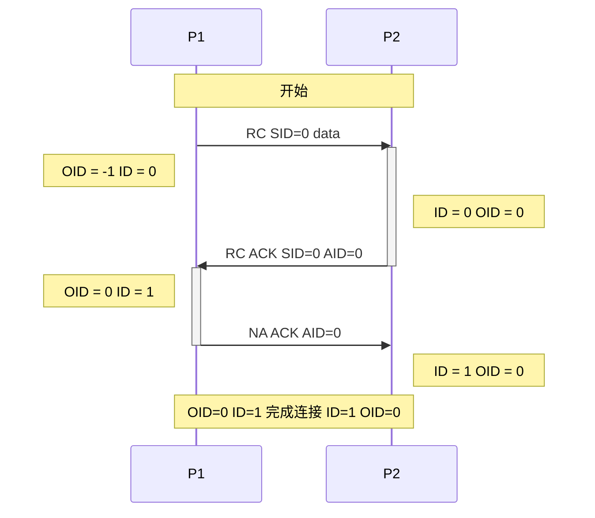
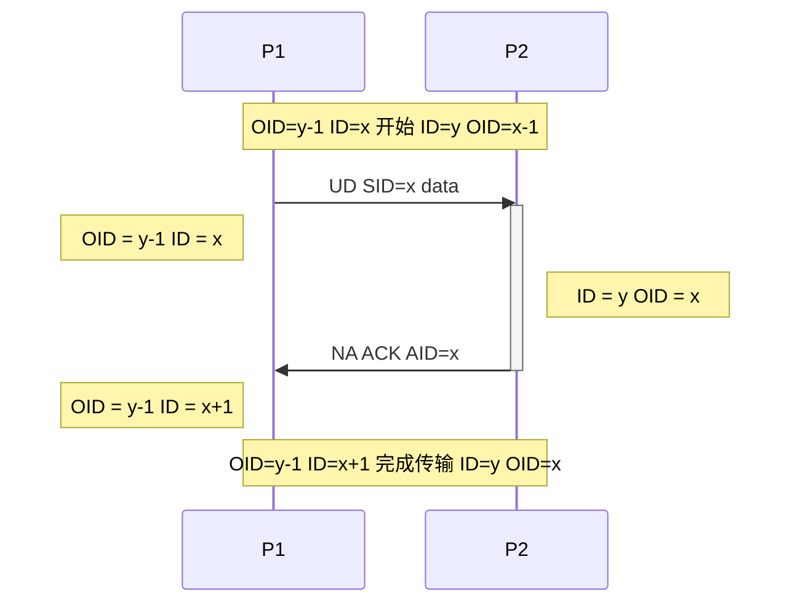
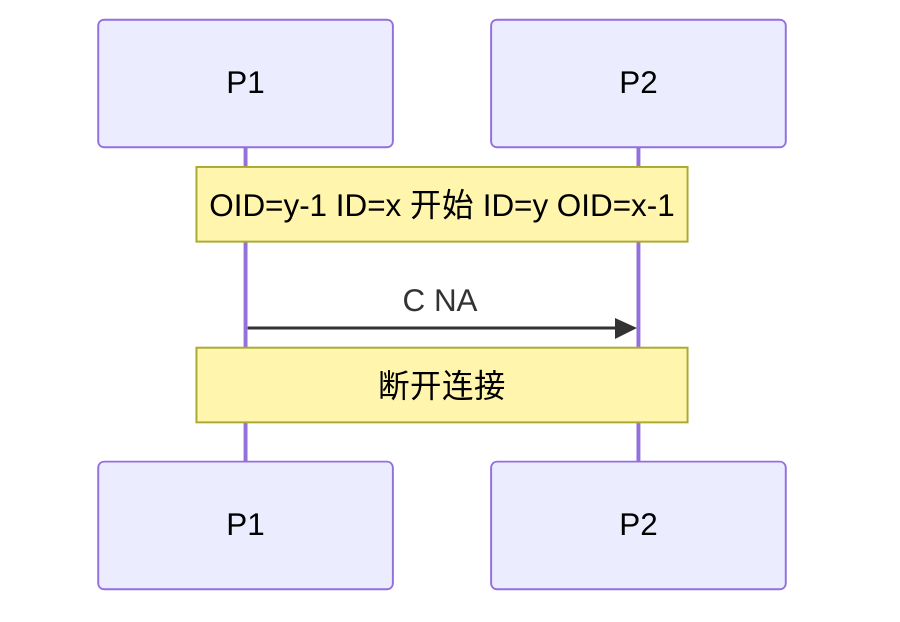

# CSCP协议
### 版本22
### CSG framework's Server and Client communication Protocol
### CSG框架 服务器与客户端通信协议

## 更新日志
* 解除对IPv4和IPv6的限制(22)
* 规定协议只能使用小端序(21)
* CSCP重构(20)

---

# 目录

* [`协议`](#协议)
    *  [`协议表`](#协议表)
        * [`名称含义`](#名称含义)
        * [`协议表说明`](#协议表说明)
        * [`含义解析`](#含义解析)
    * [`cf命令和属性`](#cf命令和属性)
        * [`flags 属性`](#flags-属性)
        * [`cmd 命令`](#cmd-命令)
    * [`通信规则`](#通信规则)
    * [`通信过程`](#通信过程)
        * [`3次握手`](#3次握手)
        * [`数据传输`](#数据传输)
        * [`1次挥手`](#1次挥手)
    * [`连接问题`](#连接问题)

---
# 协议
* 未经授权, 严禁将本协议转发他人或公布于众
* 本协议基于UDP, 面向连接协议, 无流量控制可靠传输应用层协议
* 本协议只关心数据包可靠传输, 对于数据内容请自行定义
* 本协议需要自行实现应用层协议管理器和协议对象, 关于实现说明均在下文可查看

## 协议表
<table>
    <tr>
        <td>字节</td>
        <td>0</td>
        <td>1</td>
        <td>2</td>
        <td>3</td>
        <td>4</td>
        <td>5</td>
        <td>...</td>
    </tr>
    <tr>
        <td>S0</td>
        <td>cf</td>
        <td colspan=2>SID</td>
        <td colspan=4></td>
    </tr>
    <tr>
        <td>S1</td>
        <td>cf</td>
        <td colspan=2>AID</td>
        <td colspan=4></td>
    </tr>
    <tr>
        <td>S2</td>
        <td>cf</td>
        <td colspan=2>SID</td>
        <td colspan=2>AID</td>
        <td colspan=2></td>
    </tr>
    <tr>
        <td>S3</td>
        <td>cf</td>
        <td colspan=5>data</td>
        <td>...</td>
    </tr>
    <tr>
        <td>S4</td>
        <td>cf</td>
        <td colspan=2>SID</td>
        <td colspan=3>data</td>
        <td>...</td>
    </tr>
    <tr>
        <td>S5</td>
        <td>cf</td>
        <td colspan=2>SID</td>
        <td colspan=2>AID</td>
        <td>data</td>
        <td>...</td>
    </tr>
</table>

### 名称含义
| 名称 | 含义 |
| :-: | :-: |
| cf | 命令和属性 |
| SID | 本包ID |
| AID | 应答包ID |
| data | 用户数据 |

### 协议表说明
* 协议表中前1个字节固定长度: cf
* 从第2个字节开始为可变数据结构
* S0 ~ S5 分别对应6种不同的结构体, 如何确定结构体请参见[cf](#cf命令和属性)字段解析

### 含义解析
* cf命令和属性: 表示当前发送包的命令和属性
* SID本包ID: 表示当前自己发包的ID号, 为了避免乱包以及方便丢包重发  
  * 当cmd的NA位为true时, 本包ID可忽略
  * 当包ID大于65535时从0开始
* AID应答包ID: 表示应答对方的包ID号, 当cmd为ACK时, 需要应答包ID号
* data用户数据: 表示该包中的用户数据

## cf命令和属性
<table>
    <tr>
        <td>位</td>
        <td>7</td>
        <td>6</td>
        <td>5</td>
        <td>4</td>
        <td>3</td>
        <td>2</td>
        <td>1</td>
        <td>0</td>
    </tr>
    <tr>
        <td>名称</td>
        <td colspan=5>flags</td>
        <td colspan=3>cmd</td>
    </tr>
    <tr>
        <td>含义</td>
        <td colspan=5>属性</td>
        <td colspan=3>命令</td>
    </tr>
</table>

### flags 属性
| 位 | 名称 | 含义 |
| :-: | :-: | :-: |
| 7 | UDL | 链表包 |
| 6 | UD | 用户数据 |
| 5 | NA | 无需应答 |
| 4 | RT | 重发包 |
| 3 |  |  |

### cmd 命令
| bin | hex | 名称 | 含义 |
| :-: | :-: | :-: | :-: |
| 000 | 0 | NULL | 无命令 |
| 001 | 1 | RC | 请求通信 |
| 010 | 2 | ACK | 应答 |
| 011 | 3 | RC ACK | 请求应答 |
| 100 | 4 | C | 结束通信 |
| 101 | 5 | H | 心跳包 |
| 110 | 6 |  |  |
| 111 | 7 |  |  |

## 通信规则
* 本协议所有整形数据均使用小端序进行dump
* 请求通信可以由任意端发起, 必须伴随3次握手过程, 否则视为无效数据
* 结束通信只需要发送C NA数据包即可, 若不是C NA, 视为无效数据
* 如果是是无需应答的包, 本包ID(SID)可以省略
* 应答包需要包含应答包ID, 应答包ID(AID)值为对方发的需要确认的ID
* 纯ACK命令(应答包)无需应答, NA必须为true, 否则数据包无效
* 心跳包, 请求通信, 必须应答, NA必须为false, 否则数据包无效
* 请求通信允许包含用户数据, 关于用户数据合法性由更上层协议判定
* 心跳包, 应答包不能包含用户数据, UD位和用户数据会被忽略
* 如果UD位为false(不包含用户数据), UDL位会被忽略
* 包含命令的数据包不能是链表包, UDL位会被忽略
* RT与NA为互斥位, 只能允许其中一个为true, 否则视为无效数据
* 当NA位为false时, 数据传输为可靠传输
  * 当UDL位为true时, 表示接下来连续的几个用户数据包为连续数据, 此时不会立即触发readyRead, 而是等待最后一个用户数据包的UDL位为false时表示连续包结束. 在本次传输中所有数据包加起来的数据大小总量叫做传输数据量
  * 用户数据长度最大不超过`1KB`, 若超过`1KB`, 将会把数据包拆成若干个链表包(`1KB`为自定数据块大小)
  * 一次可靠传输中最大传输数据量不能超过m = 65534 * `1KB`, 如果超过m的大小, 需要在更上层进行拆包断点续传, 把大于m的数据包拆成若干个小于m的小数据包, 一次只传一个小数据包(`1KB`为自定数据块大小)
  * 发送窗口大小最大为`256`个, 也就是一瞬间最多允许发送`256KB`数据. 若发送的数据包超过`256`个, 多出来的数据包将队列到发送缓存, 当窗口内有连续性被应答的数据包, 窗口立即向后滑动(`256`为自定发送窗口大小)
  * 如果对方应答超时后重发数据包, RT必须为true, 否则可能会造成接收方误判
* 当NA位为true时, 表示立即发送的数据无需应答, 此时可以不保证可靠传输, 用户数据长度不限(最大不超过2GB)
* 在连接过程或者通信过程中, 如果任意一端出现不可修复的特殊情况或错误, 可以发送C NA UD data数据包来立即终止本次通信, data的内容为错误信息
* 普通数据传输可代替心跳包. 心跳包的作用只是在连接空闲时检测对方在线状态, 如果普通数据传输正常, 说明对方在线状态正常, 此时无需发送心跳

## 通信过程
### 3次握手

### 数据传输

### 1次挥手

## 连接问题
* 如果有重复连接同一个主机的情况, 管理器可以直接检索连接列表里已连接的对象, 并直接触发连接成功, 返回该对象
* 本协议不允许使用域名, 只能使用IP地址连接  
  若迫不得已使用域名, 请自行实现域名解析与多条目检索等功能
